# 12 个原生实验页面截图

2026-09-29，微信开发者工具真实捕获并逐张查看。390×753、默认字号16、基础库3.17.1；游客离线。只证明图中的单一状态，不能代替所有页面状态、大字号、键盘、真机或云端验证。完整说明见 [previews/README.md](previews/README.md)。

[返回审计总览](README.md)

## 01 · 照护收件箱

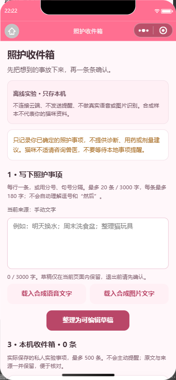

## 02 · 私人照护日程

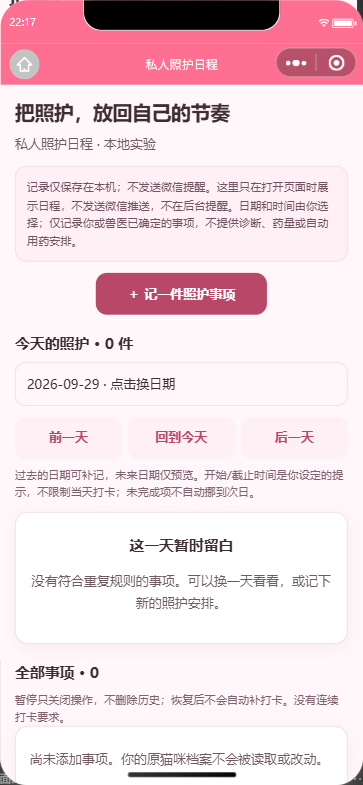

## 03 · 小屋协作目标

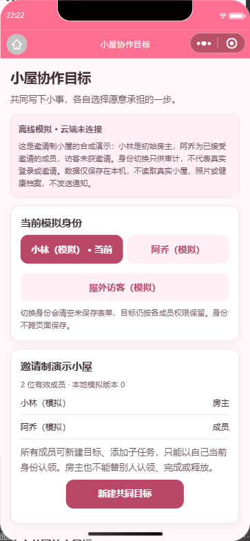

## 04 · 专注陪伴

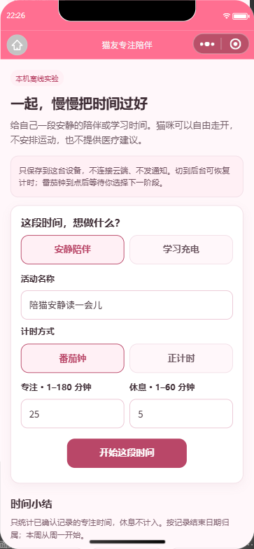

## 05 · 私人养猫账本

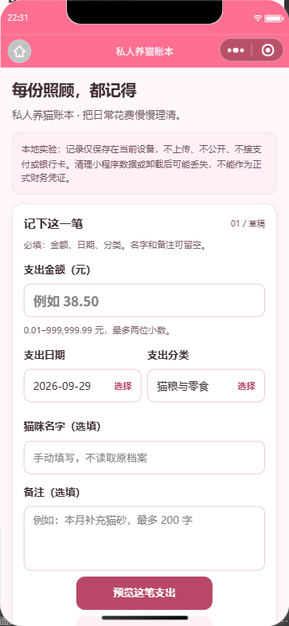

## 06 · 私人猫咪日记

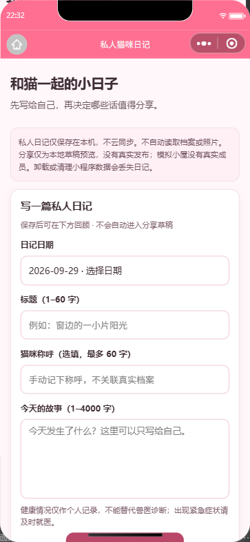

## 07 · 低压力猫友续聊

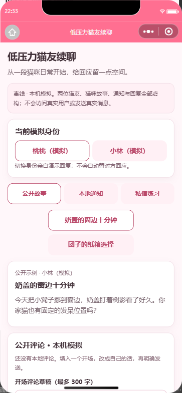

## 08 · 可控陪伴偏好

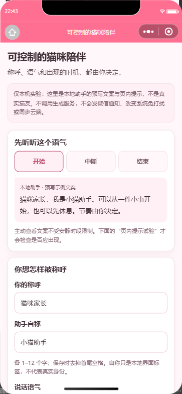

## 09 · 多端一致性契约

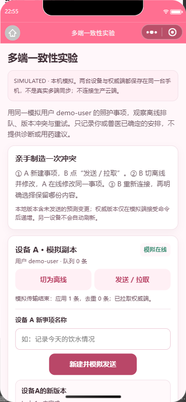

## 10 · 目击与回访

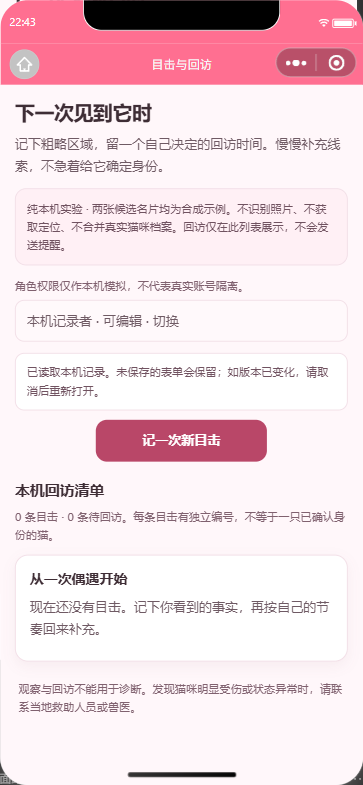

## 11 · 有向关系观察

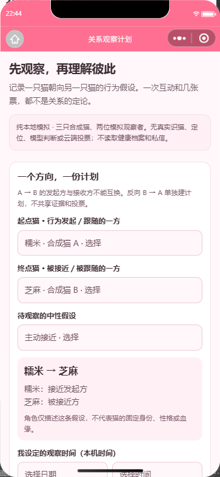

## 12 · 知识与反馈转行动

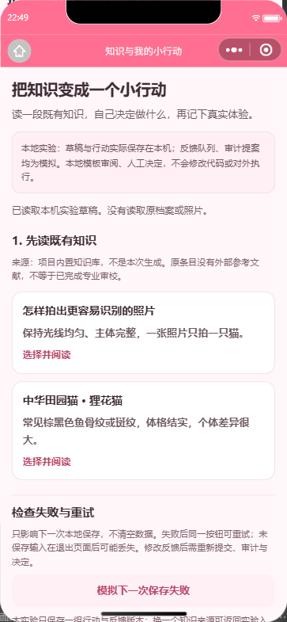
