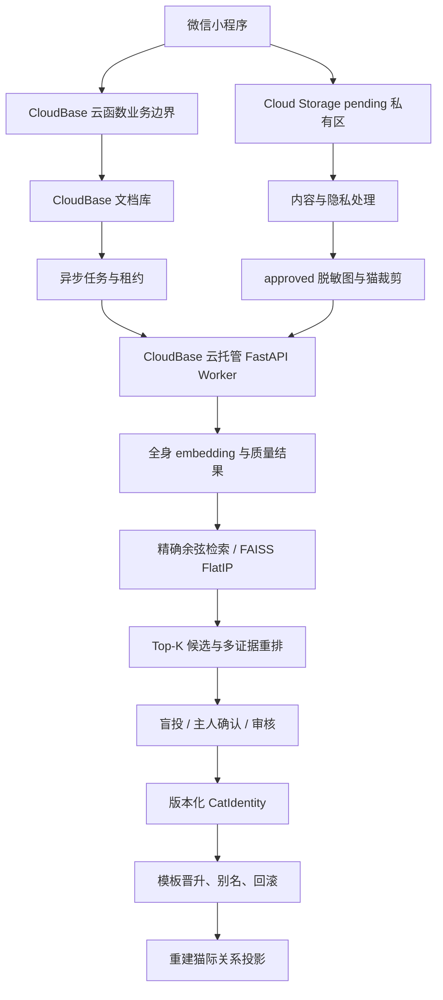
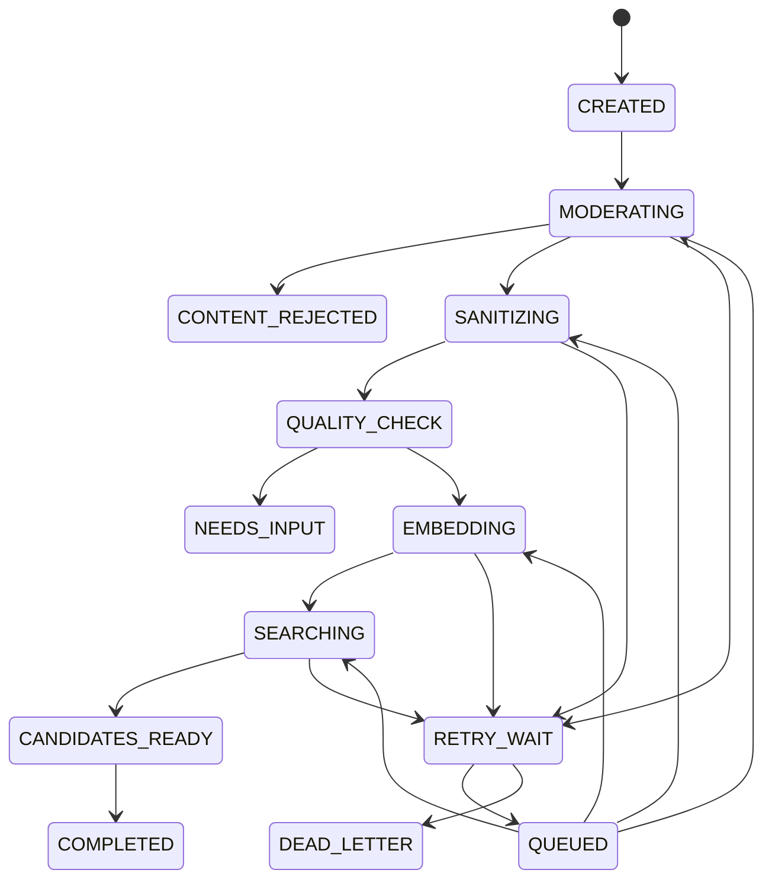
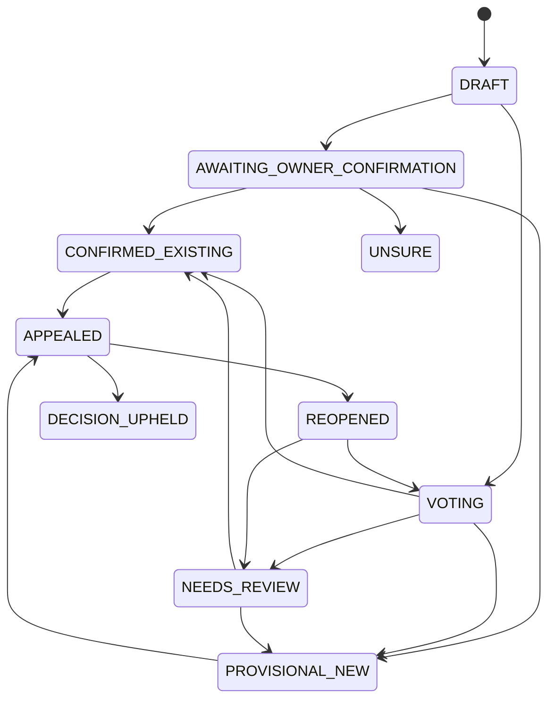
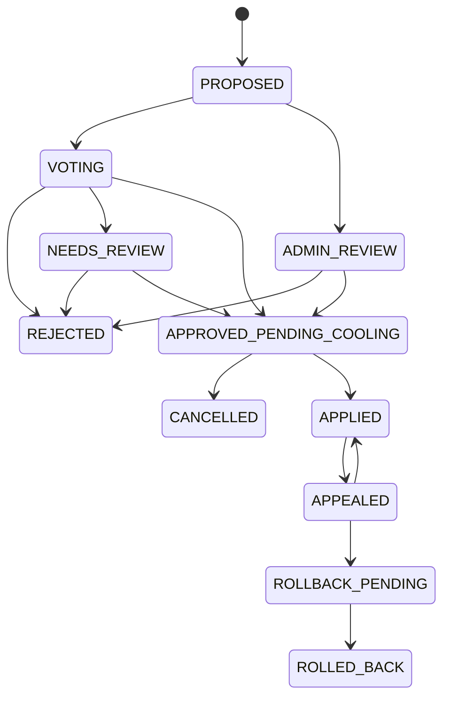

# Cat-AI 同猫识别技术路径实施方案（联机版）

| 项目 | 内容 |
| --- | --- |
| 方案版本 | 2.0 |
| 日期 | 2026-08-27 |
| 状态 | 技术设计基线，尚未形成生产阈值 |
| 目标端 | 微信小程序 + CloudBase + CloudBase 云托管；Android 后续复用 |
| 适用范围 | 家庭猫、社区猫的“可能是同一只”候选检索、确认、合并与撤销 |
| 不适用范围 | 法律身份认证、血缘鉴定、医疗诊断、仅凭一张照片自动定案 |

> 本文是现有《猫咪个体识别改造方案》的联机版升级路线。现有《猫咪个体识别验证记录》仍作为 POC 证据保留，但其中基于少量图片得到的分数和阈值不得用于生产。

## 1. 结论先行

同猫识别可做，推荐采用以下技术定义：

> 开放集候选检索 + 多视角模板 + 多证据融合 + 盲投/审核 + 可撤销身份簇。

它不是“给照片分类到某只已知猫”，因为线上每次上传都可能是一只从未入库的新猫。系统必须同时回答两个问题：

1. 图库里最相似的是谁；
2. 图库里是否根本没有这只猫。

首版必须遵守以下决定：

1. 模型只生成候选，不直接合并猫档案。
2. “都不是，可能是新猫”是一级结果，不能强迫用户在 Top-K 中选择。
3. 未裁决照片只进入隔离区，不进入正式模板库。
4. 原始目击记录不因合并而删除；合并用别名和事件实现，必须能撤销。
5. 精确位置、原图、OpenID、embedding 只在服务端私有域处理。
6. MiniMax/Kimi 等大语言模型不参与身份真值判定。它们可继续做品种描述、知识问答，不能充当同猫模型。
7. Beta 阶段 `auto_merge_count` 必须为 0。

综合可行性：

| 模块 | 可行性 | 判断 |
| --- | --- | --- |
| 小程序上传、任务状态、人工确认 | 高 | CloudBase 现有能力足够 |
| 单路全身 embedding Top-K 召回 | 高 | 现有 ONNX POC 可复用 |
| 时间地点辅助排序 | 高 | 技术简单，隐私和可信来源更重要 |
| 社区盲投、回滚、审计 | 高 | 需要先建设云端数据层和事务规则 |
| 纯照片高可靠自动认猫 | 中低 | 相似花色、成长、姿态和开放集会显著放大误合并 |
| 脸部 + 身体 + 局部斑纹融合 | 中 | 可提高效果，但模型许可和真实数据仍需补齐 |
| 公开环境自动合并 | 暂不建议 | 误合并会污染模板、档案和猫际关系网络 |

## 2. 当前项目基线与缺口

### 2.1 已有可复用能力

- 小程序已初始化 CloudBase 环境 `cloud1-d6gpjpxunc74669d7`。
- 当前图片识别链路已具备小程序上传、云函数调用、状态反馈的基础结构。
- `open-noodle/pet-recognition-small` POC 已成功完成本地 ONNX 推理：
  - 模型大小约 89 MB；
  - 输入为 `224 × 224` RGB；
  - 输出 512 维 L2 归一化向量；
  - 相似度可使用余弦相似度，即归一化向量点积；
  - 已记录模型 SHA-256，可用于固定模型版本和启动校验。
- Android SQLite 已有 `identity_templates`、`identity_match_events` 等数据表骨架，可在联机方案稳定后复用相同数据语义。
- 猫际关系网络已经使用稳定的猫 ID，不必依赖猫名，可在身份合并/撤销后重建投影。

### 2.2 现状不能直接上线的原因

1. 当前 `identifyCat` 是品种/外观识别：把整张图片发给 MiniMax，并在结束后删除临时图片；它不是个体 Re-ID。
2. 当前猫档案和猫际关系主要在 `wx.getStorageSync`，缺少跨用户身份、权限和云端版本。
3. 当前 FastAPI 没有适合多人生产环境的用户隔离，不应直接部署为联机身份服务。
4. 当前 Re-ID 数据只有 2 只真实不同猫，再加人工扰动图，只能证明“预处理—推理—相似度”链路可运行。
5. 当前 POC 对整图做中心方裁剪，没有猫检测、目标框选或背景抑制；它可能裁掉猫，也可能主要学习背景。
6. 当前评测器采用图片级留一法，不能防止同一连拍、裁剪或压缩副本跨图库和查询集。
7. 当前评测重点是二图 AUC/EER/FAR；线上实际是包含大量库外新猫的 1:N 开放集，必须改用 FPIR/FNIR 和目标图库规模评测。
8. 现有 `0.6 × 最高模板分 + 0.4 × Top-3 均值` 只能作为排序基线，不能解释为概率。
9. Android 虽已预留数据表，但尚未接入 `onnxruntime-android`、模板 CRUD 或身份 Bridge；不能把“有表”误认为“端侧识别已完成”。

## 3. P0 系统不变量

这些规则不是可选优化，而是上线前必须由代码和测试共同保证的约束。

| 编号 | 不变量 |
| --- | --- |
| I-01 | 模型只能提出候选，Beta 期间不得调用自动合并路径 |
| I-02 | 未知猫可以明确选择“都不是”或“无法判断” |
| I-03 | 未决、单人随手确认、低质量照片不得晋升为可信模板 |
| I-04 | 不同模型、预处理、检测器或裁剪版本的向量不得直接比较 |
| I-05 | 原始目击默认不可变；隐私删除使用派生数据清理和匿名 tombstone |
| I-06 | 合并是版本化事件，不是物理删除或批量改写 |
| I-07 | 时空证据、属性证据、模型分数、社区多数中的任何一项都不能单独完成合并 |
| I-08 | 精确位置、原图、OpenID、embedding 不得出现在客户端响应、公共集合或普通日志中 |
| I-09 | 上传者不能给自己的公共同猫案件投票；模型也不算一票 |
| I-10 | 身份撤销后必须同时失效受污染模板、重建索引和重算派生关系 |

## 4. 核心领域模型

同猫识别不能只在现有 `pet` 上增加一个 `similarity` 字段。需要把“照片证据”和“猫身份”分开。

| 对象 | 含义 | 关键规则 |
| --- | --- | --- |
| `Sighting` | 一次带时间、地点和上传者的目击事件 | 一次可包含多只猫、多张照片 |
| `Encounter` | Sighting 中的一只具体猫 | 多猫照片必须由用户选择目标，分别产生 encounter |
| `MediaAsset` | 原图、脱敏图、缩略图、裁剪图及其血缘 | 原图私有，公开只使用脱敏衍生图 |
| `CatIdentity` | 当前系统认为的一只规范猫 | 可为 provisional、confirmed、merged、disputed |
| `IdentityTemplate` | 某只猫经确认的高质量裁剪与 embedding | 保留多视角、多会话模板，不只保存平均向量 |
| `MatchJob` | 一次异步质量检测、embedding 和检索任务 | 幂等、有租约、可重试、有模型和索引版本 |
| `MatchCandidate` | 查询 encounter 对某个 CatIdentity 的候选证据 | 保存原始分路特征，客户端只显示等级和可解释证据 |
| `IdentityCase` | “Encounter A 是否属于 Cat B”的待裁决命题 | 支持同一只、不同、无法判断、申诉和复核 |
| `MergeCase` | “两个既有 CatIdentity 是否应合并”的独立案件 | 与 encounter assignment 分离，具有冷静期和 pending alias |
| `IdentityVote` | 一名独立用户对案件的判断 | 唯一、防重、首投前盲化 |
| `IdentityAssignment` | Encounter 到 CatIdentity 的版本化归属 | 记录来源、置信、案件和身份版本 |
| `MergeEvent` | 两个身份簇的合并或补偿撤销事件 | 只追加；旧 ID 变为 alias，不物理删除 |

必须把两类“关系”严格分开：

- `same_as`：身份层，表示两份记录属于同一只猫；
- `seen_with / friendly / tense`：猫际关系层，表示两只不同猫共同出现或互动。

`same_as` 不能直接写进猫际关系边。身份合并或撤销后，猫际关系应从原始 sighting/encounter 证据重新投影。

## 5. 目标架构



职责边界：

- 小程序负责拍照引导、手工选猫/裁剪、上传、展示状态、候选确认和投票。
- 云函数负责可信 OPENID、权限、事务、幂等、限流、任务和审计。
- 云托管 Worker 只做无状态图片计算，不信任客户端、不决定同猫、不写最终身份。
- 文档库保存业务真值；向量索引只是可重建的检索投影。
- MiniMax 继续留在现有品种识别和知识问答链路，不进入此架构。

## 6. 端到端业务流程

### 6.1 新目击上传

1. 用户选择社区/家庭范围；默认只在当前 `communityId` 内检索。
2. 小程序创建一次性 upload session，获得受控 cloud path。
3. 用户拍摄或选择 1–3 张照片，填写或跳过观察时间/地点。
4. 云函数校验文件所有者、路径、MIME 魔数、字节数、尺寸和 upload session 状态。
5. 原图进入 `pending`，先内容审核，再去 EXIF、生成脱敏展示图。
6. 无猫时拒绝；一只猫显示裁剪预览；多只猫要求用户点击目标，每只猫建立独立 encounter。
7. Worker 生成查询 embedding，检索候选并返回质量提示。
8. 前端显示 Top-3～Top-5 和“都不是/看不清”。
9. 私人家庭档案由明确拥有者确认；公共社区身份进入盲投或审核。
10. 裁决完成后才决定是否晋升模板、创建 provisional 新猫或建立 alias。

### 6.2 已知猫建档

建档不是要求用户一次拍齐所有照片，而是渐进式完成。

- provisional 身份：可以由一次有效目击创建，但不可支持高可信自动建议。
- basic 身份：至少 2 个独立拍摄会话、3 个有效视角。
- trusted 模板组：建议 5–8 张照片、至少 3 个不同日期/会话，并覆盖尽量多的视角桶：
  - `face_front`
  - `face_left`
  - `face_right`
  - `body_left`
  - `body_right`
  - `distinctive_part`
- 纯黑、纯白、长毛遮挡、幼猫等困难个体，应额外收集耳缘、尾巴、腿部、肉垫或稳定斑纹。
- 同一连拍最多贡献一个或少量代表模板，避免背景和设备泄漏。

私人拥有者可以为自己的封闭档案提供 `owner_verified` 模板；一旦要影响公共 canonical 身份，仍需独立证据或社区裁决。

## 7. 图片采集与质量门控

### 7.1 拍照引导

前端应逐步提示，而不是只显示“上传失败”：

- 让猫占据画面主要区域；
- 保证头部或身体斑纹清楚；
- 避免逆光、强滤镜、屏幕翻拍和严重运动模糊；
- 多猫时分别选中目标；
- 建档时优先补齐左右脸、左右身体和明显特征；
- 不能为了拍照追赶、惊吓或强行固定猫。

### 7.2 两级质量策略

`searchEligible` 和 `templateEligible` 必须分开：

- `searchEligible`：图片可用于查询，标准较宽；
- `templateEligible`：图片可污染长期图库，标准必须更严。

质量项至少包括：

| 检查项 | 搜索用途 | 模板用途 |
| --- | --- | --- |
| 解码、方向、色彩空间 | 必须通过 | 必须通过 |
| 猫数量 | 允许用户选框 | 必须确认唯一目标框 |
| 主体尺寸 | 裁剪短边低于约 256 px 时提示补拍 | 原始目标裁剪短边初值建议不低于 480 px |
| 模糊/运动拖影 | 中度可搜索 | 明显模糊不得入模板 |
| 曝光 | 可降权 | 严重欠曝/过曝不得入模板 |
| 遮挡 | 可降权 | 关键区域大面积遮挡不得入模板 |
| 视角 | 任意但需记录 | 优先补齐指定视角桶 |
| 重复图 | 可复用已有结果 | 同一近重复簇只保留代表图 |

数值门槛必须配置化。初始试验可保留原图最长边约 1600 px、JPEG 质量约 85，再由服务器生成模型裁剪；当前用于品种识别的 1280 px/72% 压缩不应直接成为 Re-ID 的永久原始资料策略。模糊、曝光和主体占比阈值必须按真实设备数据校准，不能照搬通用常数。

### 7.3 媒体血缘

每个衍生物记录：

```text
source asset
  ├─ sanitized display image
  ├─ thumbnail
  ├─ cat crop
  ├─ face/body/part crop
  └─ embedding(modelVersion + preprocessVersion + cropVersion)
```

删除或撤销时依靠这条血缘清理所有派生物，避免 embedding 或索引残留。

## 8. 模型技术路线

### 8.1 V0：全身 embedding 召回

首个可部署候选为 `open-noodle/pet-recognition-small`：

- 许可证标注为 Apache-2.0；上线前仍需保存模型卡和许可证快照；
- 以 DINOv2-small 为主干，输出 512 维 L2 embedding；
- 输入契约必须与模型卡一致：RGB、固定 resize/crop、ImageNet normalization；
- 只比较同一 `modelSha256 + preprocessVersion + cropVersion` 产生的向量；
- 归一化向量的余弦相似度可用内积计算。

现有模型卡指标来自较小且特定的数据集，只能证明它值得做候选召回，不能直接复用其阈值或准确率宣传。

V0 流程：

```text
审核后的目标猫裁剪
→ 预处理契约校验
→ 512D L2 embedding
→ 模板级 Top-M 检索
→ 按 catId 聚合
→ 身份级 Top-K
→ 时空/属性轻量重排
→ 候选确认
```

在自动猫检测器的许可证、召回率和多猫行为达到验收前，V0 先使用“用户点选目标 + 服务端校验裁剪”。目标框可向外扩约 10% 保留身体轮廓，但该比例只是工程初值，必须与模型训练时的 whole-animal crop 分布共同校准。

图库较小时优先精确检索：

- 小于约 10,000 个模板：NumPy 矩阵点积或 FAISS `IndexFlatIP`；
- 50,000 个 512 维 float32 向量约占 98 MiB，1–2 GB Worker 可承载；
- 只有在真实规模和延迟证明有必要时，再引入 HNSW、pgvector 或专用向量数据库。

### 8.2 身份级聚合

不能只取单张模板最大值。候选特征至少包括：

- 同视角最高相似度；
- 每个会话最多一个代表分数后的 Top-m 均值；
- 中位数与分数离散度；
- 支持该候选的独立会话数；
- 模板质量加权分；
- Top-1 与 Top-2 身份间隔；
- 查询与模板的视角兼容性；
- 该身份模板数量，防止模板多的猫天然占优。

现有公式：

```text
S_body_raw = 0.6 × max_template + 0.4 × mean(top_3_templates)
```

可继续用于 V0 排序对照，但不得显示为“同猫概率”，也不得单独触发合并。

### 8.3 V1：多路证据融合

在 V0 建立本地真实数据后，再加入：

1. 猫脸路：仅在正脸/侧脸质量足够时生成独立 embedding。
2. 身体路：延续全身 embedding，负责广召回。
3. 局部斑纹路：只对 Top-K 使用局部关键点和几何一致性重排。
4. 稳定属性路：耳剪、耳缺口、尾型、明显斑纹、已验证性别等。
5. 时空路：距离、时间差、来源可信度、定位精度和社区范围。

PetFace 可用于研究上限和评测协议参考，但其官方仓库声明数据、代码和权重仅限非商业研究，因此不能直接进入公开产品。WildFusion 的“全局召回 + 局部匹配 + 分数校准”可作为方法参考；真正引入每个模型、权重和依赖前必须单独完成许可审查。

### 8.4 校准与融合

不同分路的原始分数不在同一尺度，禁止直接平均。推荐：

1. 在独立 calibration 集上分别对 body、face、local 做 logistic 或 isotonic calibration；
2. 输出经过校准的证据概率和置信区间；
3. 使用简单可审计的 logistic 融合模型；
4. 缺失某一路时动态省略，并显式加入 `modality_missing` 特征；
5. 时空和属性贡献设上限，防止它们覆盖视觉强反证；
6. 每次融合都保存 `calibrationVersion` 和特征快照。

概念形式：

```text
logit(P_same) = b
              + w_body  × logit(p_body)
              + w_face  × logit(p_face)
              + w_local × logit(p_local)
              + w_attr  × attribute_features
              + w_space × spacetime_features
              + w_q     × quality_features
```

这是训练目标，不是手工填权重的配置公式。没有通过校准前，客户端只能显示“可能候选 / 证据不足 / 建议作为新猫”，不能显示伪精确百分比。

### 8.5 时间地点的正确用法

- `uploadedAt` 只取服务端时间；
- `observedAt` 记录用户选择或 EXIF 来源，不能视为不可伪造；
- 位置保存 `current / map / exif / manual / none` 来源和精度；
- 地点用于分层召回和排序，不能硬性排除被带走、走失或上传旧照片的猫；
- 只有高可信时空冲突才能作为强反证，仍需人工查看；
- 坐标系、时区和精度必须一起存储，禁止混用 GCJ-02 与 WGS84 后直接计算距离。

## 9. 模板策略与污染防护

### 9.1 模板状态

```text
quarantined → candidate → trusted → deprecated / revoked
```

- `quarantined`：刚上传或案件未决；不参与正式图库。
- `candidate`：质量合格但证据不足；可在影子索引中评估。
- `trusted`：主人已知身份的私有模板，或经社区/专家裁决的公共模板。
- `deprecated`：模型升级或视角冗余后不再检索，但保留审计。
- `revoked`：错误合并、隐私删除、污染或申诉成功后失效。

### 9.2 晋升规则

一张照片只有同时满足以下条件才可进入 trusted：

- `templateEligible=true`；
- 来源身份明确；
- 非重复/连拍污染；
- 具有允许的同意和保留范围；
- 案件已完成，且不在冷静期/申诉中；
- embedding 的模型、预处理、裁剪和质量策略版本完整；
- 公共身份至少有独立证据或可信审核，不由单个陌生上传者决定。

首轮容量策略建议：同一 `(cat, branch, view, session)` 最多保留 1 个模板，每个视角最多 3 个 active 模板，每只猫约 12–18 个 active 模板。写入时必须校验向量全为有限数、维度为 512、dtype/endianness 明确，L2 norm 在约 `0.99–1.01` 内；这些约束随模型契约版本冻结。

### 9.3 查询与图库隔离

当前查询 embedding 不能立刻加入图库再反过来匹配自己。任务必须保存使用的 `gallerySnapshotId`；只有裁决后产生的新模板才进入后续索引版本。

## 10. 人工确认、社区投票与裁决

### 10.1 两种确认模式

1. 私有主人模式：用户在自己的家庭猫库中确认，影响自己的档案和私有模板。
2. 公共社区模式：会影响共享 canonical 身份，必须经过独立投票或审核。

私有确认不能直接合并两个公共身份簇；它只能生成 `merge proposal`。

### 10.2 盲投界面规则

首轮投票前隐藏：

- 模型相似度和候选排名；
- 当前票数、比例和评论；
- 上传者身份、猫名和既有关系标签；
- 其他会引发从众的信息。

照片 A/B 顺序随机。投票选项固定为：

- 同一只；
- 不是同一只；
- 看不清 / 无法判断。

投票者至少选择一项依据，例如脸部花纹、耳缘、侧腹、四肢、尾巴、稳定特征、时空一致、时空冲突或图片不足。

### 10.3 初始治理规则

以下数字是 Cat-AI 的产品起始规则，不是模型阈值，必须在邀请测试后校准：

- 上传者不能投自己的案件；
- 至少 5 名有效独立投票者；
- “同一只”建议要求有效明确票中至少 80% 同意，并至少有 1 名可信审核者；
- “不同”达到约 70% 只表示暂不合并，不建立永久负身份结论；
- “无法判断”超过 35%、强时空矛盾或 9–12 票仍冲突时进入人工复核；
- 身份合并保留至少 24 小时冷静期；
- 模型分数不计入人票。

信誉只能由已裁决金标题、专家复核或后续强证据更新，不能用“是否跟随当前多数”自我强化。单个高信誉用户的权重应封顶，不能一票定案。

### 10.4 合并与撤销

合并过程：

1. 锁定两个身份当前版本；
2. 检查两边完整组件、已有负证据和并发案件；
3. 创建 `merge_case`、before snapshot 和 `active=false` 的 pending alias；
4. 进入冷静期；在此期间所有读取仍解析到原有两个身份，pending alias 不参与查询；
5. 冷静期结束且无申诉后，在同一事务中写入不可变 `merge_event`、激活 alias 并递增双方身份版本；
6. 不删除原始 sighting、encounter、投票和旧 ID；
7. 标记相关模板待重建，生成新索引版本；
8. 从原始证据重算猫际关系投影。

撤销使用补偿事件：恢复 assignment、撤销受污染模板、重建 profile/index/关系投影。禁止通过 A≈B、B≈C 自动推导 A≈C 并整簇折叠。

“把一个新 encounter 关联到已有猫”属于 assignment，不是 identity merge。只有两个既有 `CatIdentity` 被认为重复时，才创建 merge case。

## 11. CloudBase 数据设计

统一使用 `ci_` 前缀，将同猫识别域与现有品种识别、知识问答隔离。

### 11.1 集合

| 集合 | 关键字段 | 客户端权限 |
| --- | --- | --- |
| `ci_users_private` | `ownerKey, publicUserId, consentVersion, quota, riskLevel` | 禁止直读写 |
| `ci_communities` | `name, scope, regionPolicy, status` | 禁止直读写；经云函数返回 |
| `ci_members` | `communityId, ownerKey, role, status` | 禁止直读写；经云函数返回 |
| `ci_upload_sessions` | `uploadId, ownerKey, expectedPath, expiresAt, state, idempotencyKey` | 禁止直读写 |
| `ci_assets` | 原图/脱敏图/裁剪图 fileID、hash、pHash、审核、保留期、父资产 | 服务端私有；fileID 永不下发 |
| `ci_sightings_private` | exact location、observedAt、来源、uploader、raw asset | 禁止客户端直读 |
| `ci_sightings_public` | 粗区域、模糊时间、审核缩略图、canonicalCatId | 禁止直读写；经云函数返回 |
| `ci_encounters` | `sightingId, instanceId, cropAssetId, viewType, quality` | 经函数按权限返回 |
| `ci_jobs` | 状态、阶段、租约、重试、版本、模型/索引版本 | 仅本人通过函数查询 |
| `ci_job_events` | 只追加状态事件、耗时和错误码 | 管理端 |
| `ci_cat_identities` | `communityId, canonicalId, state, identityVersion` | 禁止直读写；经云函数返回 |
| `ci_templates` | vector、模型/预处理/裁剪版本、trustTier、来源 | 禁止客户端直读 |
| `ci_profiles` | 每 cat/model 的 centroid、代表模板、profileVersion | 禁止客户端直读 |
| `ci_candidates` | task、candidate、rank、分路原始特征、calibrationVersion | 按任务脱敏返回 |
| `ci_assignment_cases` | encounter→candidate 命题、状态、证据快照、规则版本 | 禁止直读写；经云函数返回 |
| `ci_merge_cases` | 两个既有 identity、pending alias、冷静期、状态和版本 | 禁止直读写；经云函数返回 |
| `ci_identity_votes` | caseType、caseId、voteKey、choice、reasonTags、weightSnapshot | 禁止直读写；经云函数返回本人的票 |
| `ci_assignments` | encounter→canonical cat、来源、case、版本 | 服务端写 |
| `ci_cat_aliases` | alias→canonical、mergeEvent、active、version | 服务端写 |
| `ci_merge_events` | before snapshot、依据、actor、补偿链、状态 | 审计读 |
| `ci_model_registry` | 模型 hash、许可证、契约、calibrator、activeIndex | 管理端 |
| `ci_moderation_jobs` | traceId、状态、回调、结果摘要 | 管理端 |
| `ci_audit_logs` | 安全/管理操作；不存敏感正文 | 管理端 |
| `ci_dead_letters` | 超过重试上限的任务摘要 | 管理端 |
| `ci_user_projections`（可选） | `_openid, viewType, sourceId, minimalPayload, expiresAt` | 仅本人读、服务端写；只用于实时视图 |

512 个 float32 约 2 KiB，MVP 可在 `ci_templates` 中以 `f32le-base64` 私有保存。规模增长后，向量权威副本可迁到私有对象存储或向量数据库；集合中保留 `embeddingRef + embeddingSha256`，业务 API 不变。

CloudBase 文档安全规则不能跨集合查询 `ci_members`，而 HMAC 产生的 `ownerKey` 也不能由客户端规则直接与 `auth.openid` 对比。因此所有核心 `ci_*` 业务集合默认客户端 `read/write=false`，“public”只表示字段已经脱敏，不表示可直接查询数据库。列表、详情和投票均由云函数先验证 membership 后返回。若确需 `watch` 实时更新，另建按 `_openid` 隔离、只含最小脱敏字段的 `ci_user_projections`，由服务端写入并使用文档所有权规则读取。

### 11.2 关键索引

- `ci_upload_sessions(ownerKey, idempotencyKey)` 唯一；
- `ci_assets(ownerKey, sha256)` 唯一，只做同用户去重，避免跨用户隐私关联；
- `ci_sightings_private(ownerKey, observedAt desc)`；exact location 建地理索引；
- `ci_jobs(state, nextRunAt, createdAt)`；
- `ci_jobs(ownerKey, idempotencyKey)` 唯一；
- `ci_templates(assetId, modelVersion)` 唯一；
- `ci_templates(catId, modelVersion, active, trustTier)`；
- `ci_candidates(taskId, catId)` 唯一；
- `ci_candidates(taskId, rank)`；
- `ci_assignment_cases(encounterId, candidateCatId, policyVersion)` 唯一；
- `ci_merge_cases(pairKey, state, updatedAt)`，并由事务保证同一 pair 同时最多一个开放案件；
- `ci_identity_votes(voteKey)` 唯一；
- `ci_cat_aliases(aliasCatId)` 唯一；
- `ci_members(communityId, ownerKey)` 唯一。

### 11.3 云存储路径

```text
identity-pending/{opaqueUserBucket}/{uploadId}/source.{jpg|png|webp}
identity-approved/sightings/{sightingId}/{assetSha256}/display.webp
identity-approved/sightings/{sightingId}/{assetSha256}/thumb.webp
identity-crops/{sightingId}/{encounterId}/{cropVersion}.webp
identity-quarantine/{assetId}/source.bin
identity-models/{modelVersion}/{modelSha256}/model.onnx
identity-indexes/{modelVersion}/{indexVersion}/index.faiss
```

- `opaqueUserBucket` 不使用明文 OpenID；
- pending 只允许创建者写入；
- approved 默认也禁止客户端直接读写；云函数校验 community membership 后只返回 `url + expiresAt` 的短期展示授权；
- quarantine、models、indexes 全部禁止客户端读写；
- 数据库只存长期 fileID，不保存会过期的临时 URL。

## 12. 云函数与 Worker 划分

### 12.1 云函数

建议首版用 4 个函数控制部署复杂度：

1. `catIdentity`
   - 小程序唯一业务入口；
   - action 白名单：`createUpload`、`submit`、`getTask`、`confirm`、`getBlindVoteTask`、`castVote`、`undoConfirmation`、`deleteSighting`；
   - 每次从 `cloud.getWXContext().OPENID` 获取身份，忽略 event 中任何 openid。
2. `catIdentityDispatch`
   - 仅允许定时触发器或持服务间凭证的调用方进入；
   - 定时领取 queued/retry_wait/租约过期任务，调用 Worker 并提交结果。
3. `catIdentityModerationCallback`
   - 验签、按 traceId 幂等处理异步内容审核结果。
4. `catIdentityAdmin`
   - 仅允许私有管理入口或持管理员服务凭证的调用方进入；
   - 负责复核、apply merge、补偿 rollback、profile/index 重建和模型切换。

所有正式写操作都走云函数。核心集合安全规则设置为客户端 `read/write: false`；服务端管理权限不会被安全规则自动保护，因此函数内部仍必须做 schema、权限、状态、配额和版本校验。

“客户端不可调用”不能只依赖函数名未出现在前端。Dispatch、ModerationCallback 和 Admin 必须在部署层限制触发器/IAM/私有网关，并在函数内再次验证调用方、角色、时间戳、nonce 和签名；缺失凭证或来自小程序普通调用链时一律拒绝。管理员身份从服务端 IAM/白名单映射获得，不能信任 event 传入的 role。

### 12.2 无状态 FastAPI Worker

不要直接部署当前 `backend.main:app`。新增隔离服务，例如：

```text
services/reid-service/
  app/main.py
  app/contracts.py
  app/preprocess.py
  app/quality.py
  app/embedder.py
  app/search.py
  app/calibration.py
  app/model_registry.py
  tests/
  Dockerfile
```

内部路由：

- `GET /internal/v1/health`：进程存活；
- `GET /internal/v1/ready`：模型 hash、输入输出契约和索引已就绪；
- `POST /internal/v1/reid/process`：一次完成下载、校验、预处理、embedding、检索和候选特征返回。

建议 Python 3.11、ONNX Runtime CPU、Pillow/OpenCV，初始 1 vCPU、1–2 GB、并发 1–2、最大实例 2。模型固定进镜像并在启动时校验 SHA-256，避免冷启动反复下载。

Worker 不接收 OpenID，不写最终数据库，不决定 `same_cat`。云函数到 Worker 优先使用同环境私有链路；仍建议附加 HMAC、时间戳、nonce 和 body hash 防重放。Worker 只接受 CloudBase 签发的短时文件 URL，不接受客户端任意 URL。

### 12.3 小规模检索与扩展

MVP 采用分层召回：

1. 当前用户已关联猫；
2. 当前 community 的相近粗区域；
3. 扩展到整个 community；
4. 地点缺失或视觉证据强时不能被地域硬过滤。

早期可由 dispatcher 提取最多 100 个 profile 交给 Worker 精确比较。规模增长后改为：

- 多副本 Worker 从版本化对象加载 FAISS FlatIP 快照；
- 一个串行 index writer 生成新快照；
- `ci_model_registry.activeIndexVersion` 原子切换；
- 业务真值和 embedding 权威副本不依赖 Worker 本地磁盘。

当社区有效模板达到约 50,000、单次候选频繁超过 500 或快照更新延迟不可接受时，再评估 pgvector/HNSW/专用向量服务。

## 13. API 契约

所有请求包含：

```json
{
  "schemaVersion": 1,
  "requestId": "uuid",
  "idempotencyKey": "uuid"
}
```

所有响应使用统一 envelope：

```json
{
  "ok": true,
  "requestId": "uuid",
  "serverTime": "2026-08-27T10:00:00Z",
  "data": {}
}
```

失败响应：

```json
{
  "ok": false,
  "requestId": "uuid",
  "error": {
    "code": "VALIDATION_ERROR",
    "message": "请换一张更清晰、主体更完整的照片",
    "retryable": false
  }
}
```

### 13.1 创建上传会话

请求：

```json
{
  "action": "createUpload",
  "schemaVersion": 1,
  "requestId": "r1",
  "idempotencyKey": "upload-uuid",
  "communityId": "community_x",
  "file": { "mime": "image/jpeg", "sizeBytes": 1234567 },
  "source": "camera"
}
```

响应只返回一次性 `uploadId`、受控 `cloudPath`、有效期和上限。

### 13.2 提交目击

```json
{
  "action": "submit",
  "schemaVersion": 1,
  "requestId": "r2",
  "idempotencyKey": "submit-uuid",
  "uploadId": "up_x",
  "fileID": "cloud://...",
  "observation": {
    "observedAt": "2026-08-27T10:00:00+08:00",
    "location": {
      "source": "current",
      "longitude": 0,
      "latitude": 0,
      "accuracyM": 30,
      "visibility": "private"
    }
  },
  "link": { "localPetId": "pet_x" }
}
```

返回 `sightingId`、`taskId`、`state=MODERATING` 和建议轮询时间。服务端生成 `uploadedAt`；位置字段可以整个省略。

### 13.3 查询任务

```json
{
  "action": "getTask",
  "schemaVersion": 1,
  "requestId": "r3",
  "taskId": "job_x"
}
```

完成后返回：

```json
{
  "taskId": "job_x",
  "state": "COMPLETED",
  "assignmentCase": {
    "caseId": "case_x",
    "state": "AWAITING_OWNER_CONFIRMATION",
    "version": 1
  },
  "recommendation": "candidate",
  "quality": {
    "level": "good",
    "hints": []
  },
  "candidates": [
    {
      "catId": "cat_x",
      "displayName": "团子",
      "thumbnail": {
        "url": "https://temporary-authorized-url.example/...",
        "expiresAt": "2026-08-27T10:05:00Z"
      },
      "scoreBand": "candidate",
      "rank": 1,
      "evidenceTags": ["侧身花纹接近", "同一社区"]
    }
  ],
  "modelVersion": "pet-recognition-small@sha256",
  "gallerySnapshotId": "index_x"
}
```

客户端不接收 embedding、原始余弦、内部阈值、精确位置、OpenID 或 approved fileID，也不得自行调用 `getTempFileURL` 绕过成员校验。图片授权过期后重新经云函数获取。

`high` 等级默认不在枚举中启用；只有开放集校准和统计门槛通过后，服务端配置才可把它加入响应。在此之前最高只显示 `candidate`。

### 13.4 确认或投票

私人确认：

```json
{
  "action": "confirm",
  "schemaVersion": 1,
  "requestId": "r4",
  "idempotencyKey": "confirm-uuid",
  "caseId": "case_x",
  "expectedVersion": 1,
  "decision": {
    "type": "same_cat",
    "candidateCatId": "cat_x",
    "reasonTags": ["ear_match", "coat_match"]
  }
}
```

公共投票：

```json
{
  "action": "castVote",
  "schemaVersion": 1,
  "requestId": "r5",
  "idempotencyKey": "vote-uuid",
  "caseId": "case_x",
  "expectedVersion": 3,
  "choice": "same",
  "reasonTags": ["body_pattern", "tail_shape"]
}
```

请求绝不接受 `openid`、票权、当前计数或最终状态。`voteKey=HMAC(caseId|OPENID)` 建唯一索引，投票和汇总计数在服务端事务中一起完成；事务内不能调用外部推理服务。

## 14. 三套状态机

计算任务、目击归属和身份合并具有不同的生命周期，必须拆开，不能共用一个 `state` 字段。

### 14.1 MatchJob：图片计算任务



MatchJob 只表示“图片是否计算完成”，不包含投票、冷静期或 alias。`CANDIDATES_READY` 后创建 AssignmentCase，job 即可完成并保持结果快照。

### 14.2 AssignmentCase：Encounter 归属案件



AssignmentCase 只决定某个 encounter 归属已有猫还是建立 provisional 新猫。它不会合并两个既有身份。裁决写入版本化 `ci_assignments`，后续撤销只改变 assignment 和派生模板状态。

### 14.3 MergeCase：两个既有身份的合并案件



`APPROVED_PENDING_COOLING` 只能创建 `active=false` 的 pending alias。冷静期结束后，服务端在同一事务中再次校验身份版本、案件状态和申诉，再写 merge event 并激活 alias。任何读取逻辑只解析 `active=true` 的 alias。

### 14.4 可靠性规则

- MatchJob 每次转换写 `ci_job_events`；AssignmentCase/MergeCase 分别写只追加的 case events；
- 三类对象各自维护 `version` 做乐观并发，不复用版本号；
- RUNNING 计算任务必须有 `leaseToken/leaseUntil`；
- 只有持同一 lease 的 Worker 结果可以提交；
- 网络重试、重复回调和定时器重复触发不能产生双模板、双案件或双票；
- 重试建议 10 秒、60 秒、5 分钟，最多 3 次，之后进入 dead letter；
- 推理服务调用发生在数据库事务提交之后；
- assignment 确认、merge 冷静期激活和 rollback 必须使用不同幂等键与事务边界。

## 15. 开放集评测方案

### 15.1 为什么必须重写现有评测器

二图 FAR 不能代表大图库 1:N 风险。作为直觉示例，若错误事件近似独立，单对 FAR 为 1% 时，在 100 个候选中至少遇到一个假匹配的概率约为：

```text
1 - (1 - 0.01)^100 ≈ 63%
```

真实候选并不独立，因此这不是实际 FPIR 估计，但足以说明不能拿 `FAR ≤ 1%` 当生产合并阈值。线上必须在接近目标图库规模、包含大量库外猫的条件下直接测：

- `FPIR`：库外查询却返回至少一个过阈候选的比例；
- `FNIR`：库内查询没有正确返回真猫的比例；
- `Recall@1/3/5`：人工候选列表的召回效率；
- `FTE`：因质量不合格无法提取或检索的比例；
- 校准误差：Brier、ECE 和可靠性曲线；
- 最终业务错误：误合并率、误拆分率、撤销率和人工工作量。

### 15.2 数据清单格式

新增 manifest，不再只依赖 `cat_id/图片` 目录：

```csv
asset_id,cat_id,session_id,captured_at,location_cell,device_hash,view_type,quality_tags,duplicate_cluster_id,ground_truth_source,adjudicator_ids,label_confidence,label_evidence_ref,split,consent_scope
```

强制规则：

- 同一连拍、视频邻帧、截图、裁剪、压缩和滤镜衍生图共享 `duplicate_cluster_id`；
- 同一 duplicate cluster 不得跨 gallery/calibration/test；
- gallery 与 query 至少按 session 隔离；
- 微调时 train/validation/test 的猫身份也必须互斥；
- 测试阈值只能在 calibration 集确定；
- 近重复泄漏检测失败时，本次评测直接判无效。

生产评测还必须有独立于待评系统的可信真值：

- `ground_truth_source` 只允许受控家庭长期确认、救助/收养档案、芯片核验的私有证明引用，或至少两名独立专家裁决等预先批准来源；
- `adjudicator_ids` 使用内部匿名标识，不写 OpenID；`label_evidence_ref` 指向私有证据，不记录芯片号等多余信息；
- `label_confidence` 区分 confirmed/probable/uncertain，生产 FPIR/FNIR 只使用 confirmed；
- 模型结果、当前社区多数票和依据同一结果产生的档案不能反过来充当金标；
- calibration 与最终 test 的身份、裁决人员和采集会话尽量隔离，防止循环验证。

没有可信真值的数据只能评估上传完成率、候选点击率、人工耗时等可用性，不能用来声称 FPIR、FNIR、误合并率或投票准确率。

### 15.3 三类评测集

1. `gallery`：每只已知猫的早期可信模板；
2. `known queries`：同一批猫在不同日期、地点、设备或视角的查询；
3. `unknown queries`：图库中完全不存在的猫。

需要增加困难负例：同窝、同品种、同花色、同背景、同猫窝、相同项圈，以及纯黑/纯白等外观相似猫。

### 15.4 数据阶段

| 阶段 | 建议数据 | 目的 | 能否设生产阈值 |
| --- | --- | --- | --- |
| 工程可行性 | 20 只、每只 8–12 图、至少 3 会话 | 验证契约、泄漏检查、Recall@1/3/5 链路 | 否 |
| Alpha 基线 | 至少 100 只、每只 10–20 图、至少 4 会话；另含至少 100 个 unknown identity | 选择模型、校准分数、检查困难分组 | 只能设邀请测试阈值 |
| Beta | 图库达到预计正式规模的至少 90%；含至少 3,000 次相对独立 unknown search | 测 FPIR/FNIR、治理与人工负担 | 可以形成候选展示阈值 |
| 自动化讨论 | 完整版本周期影子运行 | 评估极低误合并风险 | 仍需单独产品批准 |

若想在零观测错误时声称“95% 置信上界低于 0.1%”，按 rule of three 粗略需要约 3,000 个相对独立的库外查询。实际还要按猫身份/拍摄会话聚类，不能把大量相关图片对当作独立证据。

### 15.5 指标与报告

每次模型/预处理/阈值变更必须报告：

- 目标图库规模下 `FPIR(threshold)`；
- `FNIR@FPIR`、TPIR 和 Recall@1/3/5；
- Top-1/Top-2 margin 分布；
- FTE 与补拍原因；
- Brier、ECE、coverage-risk；
- P50/P95 推理延迟、冷启动、内存和单任务成本单位；
- 按猫身份或会话 bootstrap 的 95% 置信区间；
- 分组结果：毛色、毛长、年龄、时间跨度、正侧面、夜间、遮挡、设备、地点和社区；
- 同背景异猫、异背景同猫、换项圈、屏幕翻拍、多猫错误裁剪专项结果。

### 15.6 建议验收门槛

以下是项目目标，不是当前已达到的指标：

| 阶段 | 门槛 |
| --- | --- |
| Worker 冒烟 | 模型 hash/契约 100% 可复现；坏图不崩溃；同输入 embedding 漂移在规定容差内 |
| 工程可行性 | 报告跨会话 Recall@1/3/5，Top-3 ≥ 90%；20 只图库中的 R@20 不作为门槛 |
| Alpha 候选模式 | 至少 100 只图库中 R@20 ≥ 98%、Top-5 点估计 ≥ 95%，95% CI 下界目标 ≥ 90%；所有 FPIR/FNIR 按图库规模公开 |
| “较高候选”标签 | 邀请 Beta 的初始目标为目标图库规模下 FPIR 的 95% 单侧置信上界 ≤ 1%；未达到统计证据时统一显示“可能候选” |
| 上线辅助识别 | 冻结测试图库达到预计规模至少 90%，≥3,000 次相对独立 unknown search；目标 FPIR 的 95% 单侧上界 ≤ 0.1%、R@50 ≥ 99%、Top-5 ≥ 97%，同时公开 FNIR 和人工复核率 |
| 社区 Beta | 自动合并为 0；抽检最终误合并率目标 < 0.5%；申诉推翻率目标 < 3% |
| 熔断 | 滚动 200 个已审案件的误合并率 > 1%，暂停普通社区合并，全部转人工复核 |

即使 Top-5 达标，也只说明“真猫大概率出现在候选列表”，不代表 Top-1 可以自动合并。

### 15.7 评测工具改造

保留现有 `evaluate_dataset.py` 作为历史闭集基线，新增：

```text
tools/pet_reid/
  validate_manifest.py
  detect_duplicate_leakage.py
  evaluate_open_set.py
  calibrate_scores.py
  bootstrap_ci.py
  build_index.py
  contracts/
    manifest.schema.json
    result.schema.json
```

`evaluate_open_set.py` 必须支持：

- 指定 gallery/known/unknown；
- 多个 gallery size；
- 会话隔离；
- 模板到身份聚合；
- FPIR/FNIR/Recall@K；
- calibration 与 test 分离；
- 分组报告与置信区间；
- 固定随机种子、依赖版本和模型 hash；
- JSON + Markdown 结果，供 CI 比较回归。

## 16. 模型与索引版本生命周期

每个不可变模型版本至少记录：

```text
modelId
modelSha256
sourceUrl
licenseName
licenseSnapshotSha256
inputShape / colorSpace / normalization
preprocessVersion
cropVersion
outputDimension
calibrationVersion
qualityPolicyVersion
indexVersion
createdAt / activatedAt / retiredAt
```

升级流程：

1. 新模型以 shadow 模式生成新向量，不覆盖旧向量；
2. 回填全部有效模板，建立独立新索引；
3. 在冻结测试集和近期真实流量上比较候选漂移；
4. 检查许可、分组性能、延迟和内存；
5. 原子切换 active model/index 指针；
6. 保留旧镜像和索引一键回滚；
7. 旧案件保留当时分数与版本，不被新模型静默改写。

不同版本向量默认 fail-closed。除非未来专门训练并验证 backward-compatible representation，否则不做跨版本比较。

## 17. 隐私、安全与合规

### 17.1 数据最小化

- 位置和照片都必须可跳过，不应成为知识库等基本功能的前置条件；
- 精确坐标和公开粗区域拆成不同集合；
- 投票者只看社区/约 1–3 km 网格和模糊时间，不看精确轨迹；
- 原图去 EXIF，公开前处理人脸、车牌、门牌、二维码和联系方式；
- embedding 视为敏感派生标识，只在服务端保存；
- 同猫链路不上传疫苗、病历、体重等无关资料；
- 不把临时签名 URL、OpenID、embedding 或精确坐标写入日志。

原图建议在生成脱敏衍生图并完成审核/确认后 7 天删除；这是初始保留建议，正式上线前需在隐私指引中确认用途、期限和删除机制。审核拒绝或用户撤回时应更快清理。

### 17.2 鉴权和授权

- 云函数从 `cloud.getWXContext().OPENID` 获取可信身份；
- `ownerKey=HMAC(serverSecretVersion, OPENID)`，同时保存 key version 以支持受控轮换，不公开原始 OpenID；
- 每个查询强制包含 `communityId` 和成员关系过滤；
- 所有核心 `ci_*` 业务集合客户端默认 `read/write=false`，社区成员权限由云函数查询 `ci_members` 后执行；实时投影集合是按 `_openid` 隔离的唯一例外；
- 客户端传入的 openid、票权、owner、最终状态全部忽略；
- Dispatch/Admin/回调函数同时使用部署层 IAM/触发器限制和函数内服务签名、nonce、调用方/角色校验；
- Worker 使用私有链路或 HMAC 签名，并验证时间戳、nonce、body hash；
- 上传只接受一次性会话绑定的 CloudBase fileID，不接受任意 URL。

### 17.3 防滥用

- 每用户/社区的分钟和日上传、推理、投票限额；
- SHA-256 去完全重复，pHash 去近重复；
- 上传者禁投自己的公共案件；
- 盲投和随机 A/B；
- 重放请求、并发投票和幂等键冲突测试；
- 新账号低额度，信誉逐步开放；
- 可疑共投簇先隔离票权，不直接自动封禁；
- 所有公开内容先审核，提供举报、申诉、封禁和审计流程。

### 17.4 删除与撤回

删除请求必须沿媒体血缘清理：原图、脱敏图、裁剪、所有模型版本 embedding、profile、索引增量、缓存和待处理任务。审计日志只能保留不再能回指个人或图片的最小 tombstone，删除的数据不得在下一次模型回填中复活。

## 18. 测试矩阵

### 18.1 单元测试

- EXIF 方向、RGB、resize/crop、normalization 契约；
- embedding 维度、L2 norm、确定性和 hash；
- 模板聚合、同视角优先、模板数量封顶；
- calibration 和 score band 边界；
- alias 解析、循环检测、身份版本冲突；
- HMAC、nonce、幂等键和 voteKey；
- 坐标系、时间来源和粗粒度转换；
- 删除血缘和 revoked 模板排除。

### 18.2 集成测试

```text
create upload
→ upload file
→ moderation
→ crop/quality
→ embedding
→ candidate result
→ private confirm / public vote
→ template promotion
→ merge cooling
→ alias apply
→ relationship rebuild
→ appeal and rollback
```

### 18.3 必测故障

- 无猫、玩偶、屏幕翻拍、严重模糊、过暗、损坏图片；
- 多猫且用户选择错误框；
- 10 次网络重试只生成一个 sighting/job；
- Worker 超时、OOM、模型 hash 不符、响应 schema 不符；
- moderation callback 重复或 30 分钟未到；
- 两名管理员同时裁决；
- A=B、B=C、撤销中间合并边；
- 模型 V1 查询误连 V2 索引时必须 fail-closed；
- 删除时任务仍在运行，结果不得重新写回；
- 跨用户、跨社区、猜文档 ID、过期 URL 越权；
- 相同背景不同猫、不同背景同猫、换项圈、幼猫成长、换毛；
- GCJ-02/WGS84 混用和用户上传旧相册图。

### 18.4 性能与可靠性目标

首轮建议目标：

- Worker 热推理 P95 小于 2 秒；
- 包含冷启动和排队的候选结果 P50 小于 10 秒、P95 小于 30 秒；
- 非内容拒绝任务完成率高于 99%；
- 队列最老任务超过 5 分钟告警；
- model hash/contract 不符立即停止接单；
- dead letter 数量大于 0 即告警；
- 投票汇总在重复、并发和改票测试中保持精确。

这些是首轮工程目标，必须以真实 CloudBase 环境测量后调整。

## 19. 监控、成本与运营

### 19.1 结构化日志

允许字段：

```text
requestId, taskId, stage, state, attempt, communityId,
ownerKeyPrefix, modelVersion, indexVersion, inputShaPrefix,
durationMs, errorCode
```

禁止字段：完整 signed URL、OpenID、embedding、精确经纬度、原图 Base64、API Key。

### 19.2 指标

- queue depth、oldest age、retry/dead-letter；
- 内容审核延迟/拒绝率；
- 质量门控失败原因；
- Worker cold start、load time、CPU、内存、5xx、OOM；
- Recall/FPIR/FNIR 的离线版本趋势；
- 候选拒绝率、unknown 率、unsure 率；
- 人工改判率、申诉率、回滚率；
- 不同毛色、时间、地点、设备的分数漂移；
- 每任务存储、数据库读写、函数时长和推理实例秒；
- 精确位置访问审计和隐私事件。

### 19.3 成本控制

- 小程序直传 Cloud Storage，图片不穿过业务云函数；
- SHA-256/pHash 命中时复用允许范围内的审核/推理结果；
- 只向 Worker 提供本次需要的候选 profile；
- 模型烘入镜像，开发期允许 scale-to-zero；
- 并发先设 1–2，按内存实测提高；
- approved 只长期保留缩略图和必要裁剪，原图短期清理；
- 同猫识别完全不调用 MiniMax，避免 LLM 图像 token 成本和不可校准输出。

## 20. 分阶段实施计划

### Phase 0：契约、数据与评测地基

预计：3–5 个工程日，不含隐私审核。

交付：

- 本方案冻结为 v2.0；
- manifest/schema、状态机和 P0 不变量测试；
- `evaluate_open_set.py`、泄漏检查和模型 registry；
- CloudBase 集合、索引、安全规则草案；
- 数据授权、独立 ground-truth 来源规范和删除流程。

验收：

- 现有两猫样本只标记为 pipeline smoke；
- 评测可明确构造 gallery/known/unknown；
- 社区投票或模型输出不能被导入为 calibration/test 金标；
- 近重复跨分割时 CI 失败；
- 任何生产阈值仍为空。

### Phase 1：纯人工联机 MVP

预计：1–2 周。

交付：

- upload session、pending/approved/quarantine；
- sighting/encounter/canonical identity 数据层；
- 内容审核、脱敏、时间地点来源；
- 手工选猫/裁剪、人工选择候选或新猫；
- 合并事件、alias 和撤销；
- 不接模型也能完成全流程。

验收：

- 跨用户/社区权限测试通过；
- 网络重试不重复创建；
- 删除可清理全部派生物；
- 合并和撤销后猫际关系可重算。

### Phase 2：全身模型 Shadow 与 Top-K

预计：1–2 周。

交付：

- 独立 `reid-service` 容器；
- 固定模型 hash 和预处理契约；
- 质量门控、embedding、精确检索；
- 异步任务租约、重试和 dead letter；
- 先 shadow 记录结果，再向邀请用户展示 Top-3/5。

验收：

- 坏图、多猫和服务故障安全降级；
- 所有结果带模型/索引/裁剪版本；
- 未决结果不进入 trusted；
- 自动合并仍为 0。

### Phase 3：真实数据 Alpha 与阈值校准

预计：工程 1–2 周；数据采集日历时间约 4–8 周。

交付：

- 至少 100 只猫、跨 4 个会话且有独立可信真值的授权数据；
- 困难负例和分组报告；
- logistic/isotonic calibration；
- 目标图库规模 FPIR/FNIR；
- 拍照引导和质量门优化。

验收：

- 候选 Top-5 达到 Alpha 目标；
- 泄漏检查为 0；
- 置信区间和失败分组公开；
- 没有满足统计证据时不显示“高可信”。

### Phase 4：社区投票与治理 Beta

预计：1–2 周，之后持续运营校准。

交付：

- 盲投、唯一票、改票事务、信誉快照；
- 冷静期、申诉、管理员复核、补偿回滚；
- 异常共投、限流和审计；
- 误合并抽检和自动熔断。

验收：

- 30% 模拟协同恶意账号不能绕过可信审核；
- 合并链和撤销端到端通过；
- 滚动误合并率超过阈值时能切为全人工；
- Beta 无模型自动合并路径。

### Phase 5：多路融合

前置条件：V0 失败样本已足够、依赖许可证通过。

交付：

- 猫脸分路；
- 局部斑纹 Top-K 重排；
- 多路校准和可解释证据；
- shadow 双模型、双索引和回滚。

验收：

- 在相同冻结测试集上显著降低 FPIR 或 FNIR；
- 不以总体 AUC 掩盖困难分组退化；
- 推理成本和延迟在预算内。

### Phase 6：Android 端侧可选能力

在云端契约稳定后，Android 可使用 ONNX Runtime Mobile 做本地 embedding 和私有图库检索；联机共享仍由 CloudBase 处理身份、投票和回滚。Android 必须复用完全相同的模型 hash、预处理契约和向量版本，不应另造一套阈值。

## 21. 建议文件布局

本阶段仅制定方案，后续实施建议新增：

```text
miniapp/
  cloudfunctions/
    catIdentity/
    catIdentityDispatch/
    catIdentityModerationCallback/
    catIdentityAdmin/
  pages/
    sighting-create/
    identity-result/
    identity-vote/
  services/
    identity-api.js

services/
  reid-service/
    app/
    tests/
    Dockerfile

tools/
  pet_reid/
    validate_manifest.py
    detect_duplicate_leakage.py
    evaluate_open_set.py
    calibrate_scores.py
    bootstrap_ci.py
    build_index.py
    contracts/

docs/
  同猫识别技术路径实施方案.md
  同猫识别数据字典.md
  同猫识别评测报告模板.md
  同猫识别隐私与删除清单.md
```

## 22. 主要风险与应对

| 风险 | 等级 | 应对 |
| --- | --- | --- |
| 未知猫被强行匹配 | P0 | 开放集评测、unknown 结果、FPIR 门槛、人工确认 |
| 错误模板自我强化 | P0 | quarantined/trusted 分层，裁决后才入库 |
| 同会话泄漏使指标虚高 | P0 | session 分割、hash/pHash/视觉近重复检查 |
| 多猫裁错目标 | P0 | 多框必须手选，每个框独立 instanceId |
| 合并不可撤销 | P0 | alias、不可变事件、补偿回滚、关系重建 |
| 链式误合并 | P0 | 检查整个身份组件和负证据，禁止无复核传递合并 |
| 模型版本混用 | P0 | 完整版本标签、双索引、fail-closed |
| 图片/位置/向量越权 | P0 | 私有集合、云函数鉴权、脱敏副本、短期 URL |
| 社区刷票与共谋 | P0 | 盲投、唯一票、上传者禁投、权重封顶、异常隔离 |
| 幼猫成长/换毛造成误拆 | P1 | 多会话、多视角、provisional 身份、后续可合并 |
| 背景或项圈泄漏 | P1 | 猫裁剪、跨地点数据、硬负例专项评测 |
| 时间地点被当真值 | P1 | 保存来源/精度，只做有上限的辅助证据 |
| 用户删除后向量残留 | P1 | 媒体血缘、索引 tombstone、并发删除测试 |
| 第三方模型许可不清 | P1 | model registry 保存许可证快照，部署前法律/产品复核 |

## 23. 明确不采用的路径

1. 不把 MiniMax 的文字描述当作猫身份 embedding。
2. 不在现阶段把 PetFace 非商业权重打进公开产品。
3. 不把现有两只猫 POC 的分数写成生产阈值。
4. 不使用随机图片切分报告漂亮但泄漏的准确率。
5. 不用单对 FAR 1% 代替图库 FPIR。
6. 不让当前查询立即成为模板。
7. 不用单张最大相似度直接合并。
8. 不把地点设为硬过滤或身份证明。
9. 不把 OpenID、API Key 或模型密钥放进小程序/APK。
10. 不物理合并/删除旧猫 ID。
11. 不让全身、猫脸和局部分数未经校准直接平均。
12. 不为小规模图库过早引入复杂图数据库或近似向量集群。

## 24. 启动下一阶段的 Definition of Ready

开始编码 Phase 0/1 前需确认：

- [ ] 产品文案统一使用“可能是同一只 / 待确认”，不使用“已自动认出”；
- [ ] community 数据边界和公开范围已决定；
- [ ] 照片、位置、embedding、保留期写入隐私清单；
- [ ] CloudBase 集合、索引、安全规则和管理员边界评审完成；
- [ ] 模型许可证快照和 SHA-256 已归档；
- [ ] 数据 manifest、授权格式、ground-truth 来源和裁决规则冻结；
- [ ] 评测器能输出 FPIR/FNIR/Recall@K 和置信区间；
- [ ] `auto_merge=false` 为服务端不可绕过的配置；
- [ ] 合并、撤销和删除的端到端测试先于 UI 上线；
- [ ] 现有品种识别与知识问答不受新域改造影响。

## 25. 参考资料

- [open-noodle/pet-recognition-small 模型卡](https://huggingface.co/open-noodle/pet-recognition-small)：V0 全身 embedding 候选与许可信息。
- [PetFace ECCV 2024 论文](https://www.ecva.net/papers/eccv_2024/papers_ECCV/html/2660_ECCV_2024_paper.php)：宠物脸 verification 与 Re-ID 研究基准。
- [PetFace 官方仓库](https://github.com/mapooon/PetFace)：非商业研究限制说明。
- [Wildbook 匹配流程](https://wildbook.docs.wildme.org/data/matching-process.html)：检测、候选、位置过滤和人工审阅流程。
- [Wildbook 合并与拆分](https://wildbook.docs.wildme.org/faq/merging-faq.html)：可撤销 encounter/identity 管理参考。
- [WildlifeTools](https://github.com/WildlifeDatasets/wildlife-tools)：动物 Re-ID 评测、检索和融合工具参考。
- [WildFusion](https://arxiv.org/abs/2408.12934)：全局与局部特征校准融合方法。
- [WildlifeReID-10k](https://arxiv.org/abs/2406.09211)：时间感知拆分和 encounter 泄漏风险。
- [NIST 1:N 识别指标](https://pages.nist.gov/frvt/html/frvt1N.html)：FPIR/FNIR 与图库规模评测口径；本文只借用指标定义，不把人脸结果当作猫性能。
- [ONNX Runtime Mobile](https://onnxruntime.ai/docs/tutorials/mobile/)：后续 Android 端侧 embedding 路径。
- [CloudBase 云托管](https://docs.cloudbase.net/run/introduction)：Python/FastAPI/ONNX 容器运行环境。
- [CloudBase 云函数获取小程序身份](https://docs.cloudbase.net/recipes/add-cloud-function-wechat-miniprogram)：可信 OPENID 获取方式。
- [CloudBase 数据库事务](https://docs.cloudbase.net/database/transaction)：服务端投票、防重与状态更新事务。
- [CloudBase 数据库安全规则](https://docs.cloudbase.net/database/security-rules)：客户端读写边界。
- [CloudBase 数据索引](https://docs.cloudbase.net/database/data-index)：唯一、组合和地理索引。
- [CloudBase 云存储安全规则](https://docs.cloudbase.net/storage/security-rules)：pending/approved/quarantine 文件访问边界。
- [微信异步图片内容安全检查](https://developers.weixin.qq.com/miniprogram/dev/server/API/sec-center/sec-check/api_mediacheckasync.html)：公开图片进入投票前的审核接口参考。
- [微信小程序隐私适配说明](https://cloud.tencent.cn/document/product/1301/97930)：照片和位置信息声明参考。
- [《中华人民共和国个人信息保护法》](https://www.miit.gov.cn/zwgk/zcwj/flfg/art/2022/art_04a0f1fb5df244e39688fd5372623a8d.html)：敏感个人信息、单独同意与最小必要原则。

---

最终技术判断：当前项目已经具备“跑通一个 embedding”的能力，但离可靠的同猫系统还差四层关键工程——开放集评测、多人数据边界、模板污染防护、可撤销裁决。正确顺序是先把不可变目击、异步任务、人工确认和回滚做牢，再让模型参与候选排序；这样即使模型早期不够准，错误也不会永久污染猫档案与猫际关系网络。
